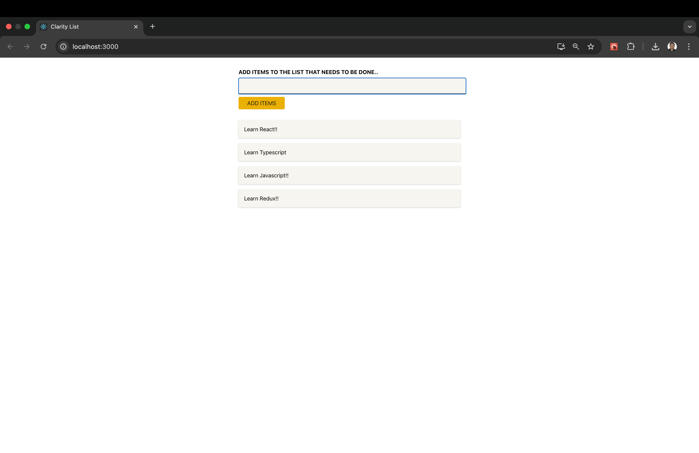

# React TypeScript App

A starter project for building scalable and maintainable web applications using React and TypeScript.

## Features

- React 18+
- TypeScript for static type checking
- Functional components and hooks
- Easy project structure for rapid development

## Getting Started

### Prerequisites

- Node.js (v16 or above)
- npm or yarn

### Installation

```bash
git clone https://github.com/your-username/react-typescript-app.git
cd react-typescript-app
npm install
```

### Running the App

```bash
npm start
```

The app will run locally at `http://localhost:3000`.

## Project Structure

```
react-typescript-app/
├── src/
│   ├── components/
│   ├── App.tsx
│   ├── index.tsx
│   └── ...
├── public/
├── package.json
└── tsconfig.json
```

## Scripts

- `npm start` — Runs the app in development mode
- `npm run build` — Builds the app for production
- `npm test` — Runs tests

## Contributing

Feel free to open issues or submit pull requests for improvements.

## License

This project is licensed under the MIT License.


